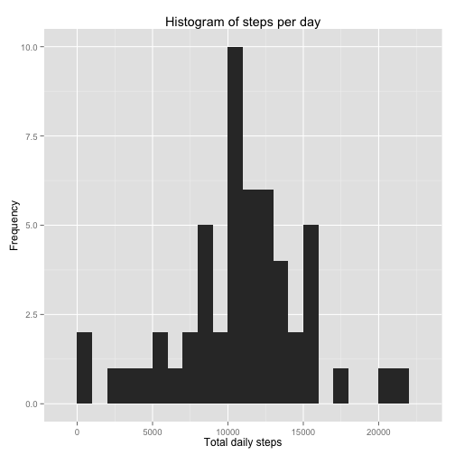
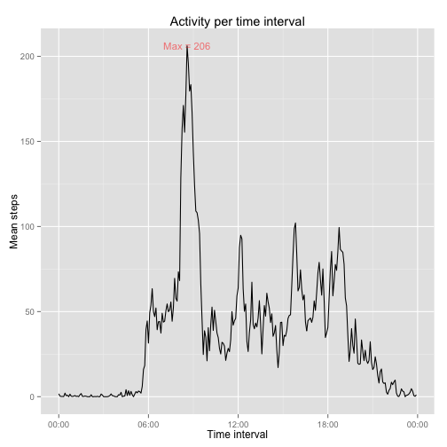
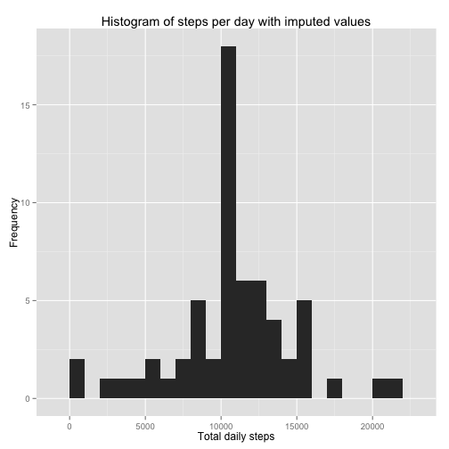
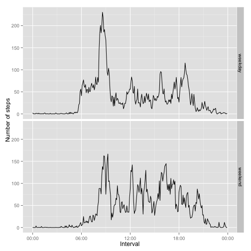

## Loading and preprocessing the data

We start by decompressing the activity.zip file into the current directory and then read the data into the variable raw_data. We also transform the string factors in the date column and the integer intervals to POSIXct objects to facilitate working them later in the analysis. We use POSIXct instead of POSIXlt for compatibility with dplyr's group_by. Before converting the intervals to POSIXct, we pad them with 0s to normalize their formatting and facilitate parsing them with strptime. Finally, we check the summary of the raw data.

```r
unzip("activity.zip")
raw_data <- read.csv("./activity.csv")
raw_data$date <- as.POSIXct(
    strptime(raw_data$date, format="%Y-%m-%d"))
raw_data$interval <- as.POSIXct(
    strptime(
        sprintf("%04d", raw_data$interval),
        format="%H%M"))
summary(raw_data)
```

```
##      steps             date                    
##  Min.   :  0.00   Min.   :2012-10-01 00:00:00  
##  1st Qu.:  0.00   1st Qu.:2012-10-16 00:00:00  
##  Median :  0.00   Median :2012-10-31 00:00:00  
##  Mean   : 37.38   Mean   :2012-10-31 00:25:34  
##  3rd Qu.: 12.00   3rd Qu.:2012-11-15 00:00:00  
##  Max.   :806.00   Max.   :2012-11-30 00:00:00  
##  NA's   :2304                                  
##     interval                  
##  Min.   :2015-03-15 00:00:00  
##  1st Qu.:2015-03-15 05:58:45  
##  Median :2015-03-15 11:57:30  
##  Mean   :2015-03-15 11:57:30  
##  3rd Qu.:2015-03-15 17:56:15  
##  Max.   :2015-03-15 23:55:00  
## 
```

## What is mean total number of steps taken per day?

To caclulate the mean steps per day we use the dplyr package to:     
- select just the date and step count columns  
- group by the dates  
- sum the steps by date and store the sums in the daily_total column  

```r
suppressMessages(library(dplyr))
daily_steps <- raw_data %>%
    select(steps, date) %>%
    group_by(date) %>%
    summarize(daily_total=sum(steps))
```

Once we have daily totals, we can use ggplot2 to construct a histogram of the frequency of daily step totals:

```r
library(ggplot2)
step_hist <- ggplot(
    daily_steps,
    aes(x=daily_total)) +
    geom_histogram(binwidth=1000) +
    xlab("Total daily steps") +
    ylab("Frequency") +
    ggtitle("Histogram of steps per day")
print(step_hist)
```

 

We can also use the daily totals to calculate the mean and median number of steps per day:

```r
daily_mean <- mean(daily_steps$daily_total, na.rm=T)
daily_median <- median(daily_steps$daily_total, na.rm=T)
```

We find that there are 10766.189 steps taken daily on average and that the median steps per day is 10765.

## What is the average daily activity pattern?

If we group the step counts by the time intervals instead of the dates, we can calculate the average activity pattern for a given time interval using dplyr:

```r
activity <- raw_data %>%
    select(steps, interval) %>%
    group_by(interval) %>%
    summarize(interval_mean=mean(steps,na.rm=T))
```

We can use the interval means to calculate which interval has the maximum average steps:

```r
max_steps <- max(activity$interval_mean,na.rm=T)
max_interval <- activity %>%
    filter(interval_mean==max_steps)
most_steps<- max_interval$interval
```

We find that the interval with most steps on average is 08:35 with 206 steps.
  
We can now use this data to plot the average number of steps per interval. Since transforming the time intervals into POSIXct dates added the current date to the intervals we also remove the dummy date from the x axis scale:

```r
library(scales)
periodic_steps <- ggplot(activity, 
                         aes(interval, interval_mean),
                         nm.rm=TRUE) +
    geom_line(na.rm=TRUE) +
    scale_x_datetime(labels = date_format("%H:%M")) +
    annotate("text",
             x=most_steps,
             y=max_steps,
             size=4,
             color='red',
             alpha=.5,
             label=paste("Max =", round(max_steps))) +
    ggtitle("Activity per time interval") +
    xlab("Time interval") +
    ylab("Mean steps")
suppressWarnings(print(periodic_steps))
```

 

## Imputing missing values
We can calculate how many missing values (coded as NAs) there are for the steps variable in the data:

```r
n_missing <- sum(is.na(raw_data$steps))
```

We find that there are 2304 missing values. We are going to use the mean step values for each time interval that we computed earlier to impute the missing values. To facilitate looking up the averages for each time interval (which we will need to do to impute the missing values), we are first going to make a named vector with the time intervals as the names of the mean values:

```r
named_activity <- activity$interval_mean
names(named_activity) <- activity$interval
```

We can then use dplyrs mutate function to copy the data and replace NA values with the mean steps for the matching time interval:

```r
imputed_data <- raw_data %>%
    mutate(steps = ifelse(
                   is.na(steps),
                   round(named_activity[as.character(interval)]),
                   steps))
```

We can now remake our steps per day histogram with the imputed data:

```r
imputed_daily_steps <- imputed_data %>%
    select(steps, date) %>%
    group_by(date) %>%
    summarize(daily_total=sum(steps))
imp_step_hist <- ggplot(
    imputed_daily_steps,
    aes(x=daily_total)) +
    geom_histogram(binwidth=1000) +
    xlab("Total daily steps") +
    ylab("Frequency") +
    ggtitle("Histogram of steps per day with imputed values")
print(imp_step_hist)
```

 

We can also see how adding the imputed values affects the mean and median values for steps taken daily:

```r
imp_daily_mean <- mean(imputed_daily_steps$daily_total)
imp_daily_median <- median(imputed_daily_steps$daily_total)
diff_mean <- imp_daily_mean - daily_mean
diff_median <- imp_daily_median - daily_median
```

We find that the mean is now 10765.639 while it was 10766.189 for the raw data: a difference of -0.549. The median is now 10762, while it was 10765 for the raw data: a difference of -3. Imputing the values slightly lowers the values of these estimates. Since we used the mean values for each time interval to impute the values, it seems that the intervals with missing values were ones with with slightly below average activity.

## Are there differences in activity patterns between weekdays and weekends?

We can use dplyr and the weekdays function add a factor variable to the data indicating whether the date for the measurements was taken on a weekday or a weekend:

```r
weekend_days <- c("Saturday", "Sunday")
weekly_data <- imputed_data %>%
    mutate(week_part = ifelse(
        weekdays(date) %in% weekend_days,
        "weekend",
        "weekday"))
weekly_data$week_part <- as.factor(weekly_data$week_part)
```

We can now use this new week_part variable to group the data by the part of the week it is from as well as its time interval to compare the activity patterns for the parts of the week:

```r
weekly_activity <- weekly_data %>%
    group_by(week_part, interval) %>%
    summarize(activity = mean(steps))
```

We can now plot this data to compare the patterns:

```r
week_plot <- ggplot(weekly_activity, aes(interval, activity)) +
    geom_line() +
    facet_grid(week_part ~ .) +
    scale_x_datetime(labels = date_format("%H:%M")) +
    ylab("Number of steps") +
    xlab("Interval")
print(week_plot)
```

 
